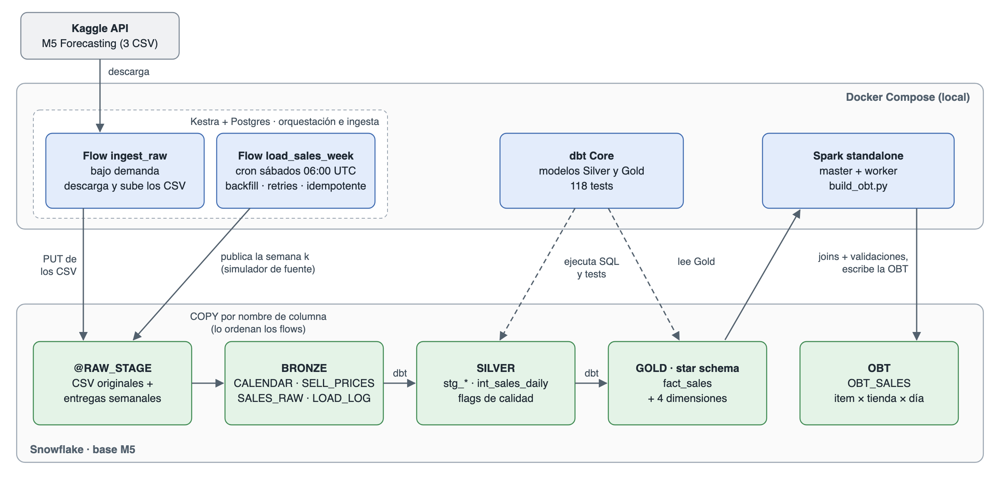
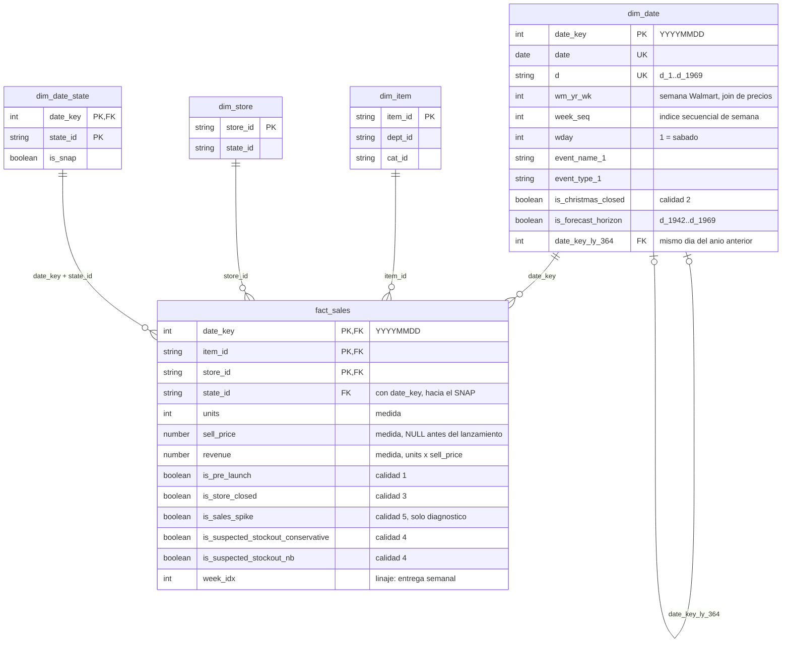

# M5 Forecast Pipeline — PSet 2

Pipeline ELT reproducible para el dataset **M5 Forecasting (Walmart, Kaggle)**, construido con Kestra, Snowflake, dbt y Spark.

```
Kaggle → Kestra → BRONZE → dbt → SILVER → dbt → GOLD → Spark → OBT
                  └──────────────── Snowflake (base M5) ───────────┘
```

- **Kestra** orquesta todo: ingiere desde la API de Kaggle hacia la capa Bronze y, después de cada carga semanal, lanza dbt y Spark (flow `transform`).
- **dbt** limpia (Silver) y modela el star schema (Gold).
- **Spark** construye la One Big Table (OBT) a partir de Gold y la escribe de vuelta en Snowflake.



Kestra, dbt y Spark corren en contenedores locales (Docker Compose); los datos viven siempre en Snowflake. Las flechas sólidas son movimiento de datos; las punteadas, SQL que dbt ejecuta dentro de Snowflake. El diagrama se regenera con `python3 docs/img/arquitectura.py`.

El enfoque del proyecto y las decisiones de diseño están en [`docs/enfoque_proyecto.md`](docs/enfoque_proyecto.md). El documento técnico de la entrega es [`docs/PSet2_memo_Soto_Tulcan_Avalos-Quiroga-Bucheli.pdf`](docs/PSet2_memo_Soto_Tulcan_Avalos-Quiroga-Bucheli.pdf).

> **Estado actual (4-oct-2026):** pipeline completo de punta a punta con las 278 semanas: Bronze (`SALES_RAW`, 8.476.220 filas), Silver y star schema de Gold construidos y testeados con dbt (59.181.090 filas en `fact_sales`), y `OBT.OBT_SALES` construida con Spark con las mismas 59.181.090 filas. Kestra encadena la carga semanal con dbt y Spark (flow `transform`). El diagnóstico de calidad está en [`docs/calidad_datos.md`](docs/calidad_datos.md).

---

## Modelo de datos (Gold)

Star schema en el esquema `GOLD`, construido con dbt desde Silver (`dbt/models/marts/`). Grain del hecho: **item × tienda × día**.



| Tabla | Filas | Contenido |
|---|---|---|
| `fact_sales` | 59,2 M | Unidades, precio vigente, ingreso y flags de calidad por serie × día |
| `dim_date` | 1.969 | Calendario completo, incluye los 28 días del horizonte de pronóstico (sin ventas en el hecho) |
| `dim_item` | 3.049 | Jerarquía item → departamento → categoría |
| `dim_store` | 10 | Tienda → estado |
| `dim_date_state` | 5.907 | SNAP por fecha × estado: depende de ambos, por eso no va en `dim_date` ni en `dim_store` |

Decisiones:
- Lo que depende solo de la fecha (eventos, Navidad, horizonte) está en `dim_date`, no repetido en el hecho.
- `wm_yr_wk` no se resta (salta de 52 a 01 y el año fiscal 2013 tiene 53 semanas): para lags semanales se usa `week_seq`.
- `date_key_ly_364` (t − 364) conserva el día de semana y es la base del baseline "año anterior".
- Tests de negocio: grain único, relaciones hecho → dimensiones (incluida la llave compuesta del SNAP), mismo conteo que Silver, ninguna venta sin precio ni antes del lanzamiento, ninguna venta en el horizonte, `revenue = units × sell_price` y calendario sin huecos.

## Stack y versiones

Todas las imágenes tienen versión fija para que el entorno sea reproducible.

| Componente | Imagen / versión | Rol |
|---|---|---|
| Kestra | `kestra/kestra:v1.3.40` | Orquestador (UI + scheduler + worker) |
| PostgreSQL | `postgres:16.15` | Backend de Kestra (flows, ejecuciones, logs) |
| Spark | `apache/spark:4.1.3-scala2.13-java17-python3-ubuntu` + conector `spark-snowflake_2.13:3.2.2-spark_4.1` (`spark/Dockerfile`) | Cluster standalone (1 master + 1 worker); construye la OBT |
| dbt Core | `ghcr.io/dbt-labs/dbt-snowflake:1.9.0` | Transformaciones Silver y Gold |
| Snowflake | Cuenta trial (Enterprise) | Data warehouse: esquemas `BRONZE`, `SILVER`, `GOLD`, `OBT` |

## Estructura del repositorio

```
pset_2/
├── docker-compose.yml   # Kestra + Postgres, Spark (master/worker) y dbt
├── .env.example         # Plantilla de variables de entorno (copiar a .env)
├── kestra/              # Flows de Kestra (se sincronizan solos con la UI)
├── dbt/                 # Proyecto dbt (profiles.yml lee todo de variables de entorno)
├── spark/               # Dockerfile (Spark + conector Snowflake) y scripts PySpark (montados en /opt/spark-apps)
├── snowflake/setup.sql  # Crea warehouse, base, esquemas, rol y usuario de servicio
└── docs/                # Enfoque del proyecto, diagnóstico de calidad y documento técnico (PDF)
```

---

## Requisitos previos

- **Docker** con Docker Compose v2 (Docker Desktop u OrbStack). Asigna al menos **8 GB de RAM** a Docker.
- **Git** y **OpenSSL** (vienen con macOS y la mayoría de distribuciones Linux).
- Una cuenta de **Snowflake** con acceso a los roles `SYSADMIN` y `USERADMIN`. Un trial gratuito sirve.
- Una cuenta de **Kaggle**.

## Puesta en marcha

### 1. Clonar el repositorio

```bash
git clone https://github.com/rosvjames/M5_forecast_pipeline.git
cd M5_forecast_pipeline
cp .env.example .env
```

Todos los valores que se configuran en los pasos siguientes van en `.env`. Ese archivo está en `.gitignore`: **nunca lo subas al repositorio.**

### 2. Snowflake

**2.1 Crear el par de llaves.** El pipeline se autentica con key-pair, sin contraseña. Genera las llaves **fuera del repositorio**:

```bash
mkdir -p ~/.snowflake
openssl genrsa 2048 | openssl pkcs8 -topk8 -inform PEM -out ~/.snowflake/rsa_key.p8 -nocrypt
openssl rsa -in ~/.snowflake/rsa_key.p8 -pubout -out ~/.snowflake/rsa_key.pub
chmod 600 ~/.snowflake/rsa_key.p8
```

**2.2 Crear los objetos.** En Snowflake, abre una SQL Worksheet, pega el contenido de [`snowflake/setup.sql`](snowflake/setup.sql) y ejecútalo completo con **Run All** (`Cmd/Ctrl + Shift + Enter`). El script es idempotente: se puede volver a ejecutar sin errores. Crea:

- el warehouse `M5_WAREHOUSE` (XS, auto-suspend de 60 s);
- la base `M5` con los esquemas `BRONZE`, `SILVER`, `GOLD` y `OBT`;
- el rol `M5_PIPELINE`, con permisos mínimos por capa;
- el usuario de servicio `M5_PIPELINE_USER` (`TYPE = SERVICE`, sin contraseña).

**2.3 Registrar la llave pública.** Copia la llave en una sola línea y sin encabezados:

```bash
grep -v "PUBLIC KEY" ~/.snowflake/rsa_key.pub | tr -d '\n' | pbcopy   # macOS; en Linux usa xclip o cópiala a mano
```

En la worksheet, ejecuta:

```sql
USE ROLE USERADMIN;
ALTER USER M5_PIPELINE_USER SET RSA_PUBLIC_KEY = '<pega aquí la llave>';
```

**2.4 Completar `.env`:**

| Variable | Valor |
|---|---|
| `SNOWFLAKE_ACCOUNT` | Account identifier (`ORGNAME-ACCOUNTNAME`). Lo encuentras en el menú de tu usuario → *Connect a tool to Snowflake*. |
| `SNOWFLAKE_USER`, `SNOWFLAKE_ROLE`, `SNOWFLAKE_WAREHOUSE`, `SNOWFLAKE_DATABASE` | Ya vienen con los nombres que crea `setup.sql`. |
| `SNOWFLAKE_PRIVATE_KEY_PATH` | Ruta **absoluta** a `rsa_key.p8`, por ejemplo `/Users/<tu_usuario>/.snowflake/rsa_key.p8`. La usa dbt. |
| `SECRET_SNOWFLAKE_PRIVATE_KEY` | La llave privada en base64. La usa Kestra. Genérala con el comando de abajo. |

```bash
base64 -i ~/.snowflake/rsa_key.p8 | tr -d '\n'     # macOS
base64 -w0 ~/.snowflake/rsa_key.p8                 # Linux
```

### 3. Kaggle

1. En la competencia [M5 Forecasting - Accuracy](https://www.kaggle.com/competitions/m5-forecasting-accuracy), pestaña **Data**, **acepta las reglas**. Sin este paso la API responde `403 Forbidden`.
2. En Kaggle → **Settings → API → Create New Token**, genera un API token.
3. Codifícalo en base64 sin que quede en el historial de la terminal. Ejecuta el comando, pega el token (no se ve en pantalla) y presiona Enter:

   ```bash
   read -rs T && printf %s "$T" | base64; unset T
   ```

4. Pon el resultado en `SECRET_KAGGLE_API_TOKEN` en `.env`.

### 4. Kestra y Postgres

Completa en `.env`:

- `POSTGRES_DB`, `POSTGRES_USER`, `POSTGRES_PASSWORD`: los valores que quieras. Postgres se inicializa con ellos la primera vez.
- `KESTRA_USER`: un email válido. `KESTRA_PASSWORD`: al menos 8 caracteres, con una mayúscula y un número. Son las credenciales de la UI de Kestra.

> **Sobre los secrets de Kestra:** Kestra (versión open source) lee como secrets las variables de entorno con prefijo `SECRET_`, y su valor **debe estar en base64**. En un flow se usan con `{{ secret('KAGGLE_API_TOKEN') }}`, sin el prefijo.

### 5. Levantar la infraestructura

```bash
docker compose up -d
```

El **primer arranque de Kestra tarda unos minutos**, porque migra la base de datos y carga los plugins. Para seguir el avance: `docker compose logs -f kestra`.

| Servicio | URL |
|---|---|
| Kestra UI | http://localhost:8080 (credenciales `KESTRA_USER` / `KESTRA_PASSWORD`) |
| Spark Master UI | http://localhost:8090 |
| Spark Worker UI | http://localhost:8091 |

dbt no aparece en esta tabla porque no queda corriendo: se ejecuta a demanda (ver más abajo).

### 6. Verificar

1. **Kestra → Snowflake:** se comprueba al ejecutar `ingest_raw` (paso 7). Su primera tarea, `bronze_ddl`, se conecta con el usuario de servicio y crea los objetos de Bronze. Si termina en verde, la conexión y los permisos están bien.
2. **dbt → Snowflake:**
   ```bash
   docker compose run --rm dbt debug
   ```
   Debe terminar en `All checks passed!`.
3. **Cluster de Spark:** en http://localhost:8090 el worker debe aparecer como **ALIVE**. Para una prueba completa:
   ```bash
   docker compose exec spark-master /opt/spark/bin/spark-submit \
     --master spark://spark-master:7077 \
     /opt/spark/examples/src/main/python/pi.py 10
   ```
   Debe imprimir `Pi is roughly 3.14...`.
4. **Spark → Snowflake:** lee `GOLD.DIM_STORE` con el conector (requiere Gold construido: hazlo después del paso 8):
   ```bash
   docker compose exec spark-master /opt/spark/bin/spark-submit \
     --master spark://spark-master:7077 /opt/spark-apps/test_connection.py
   ```
   Debe mostrar las 10 tiendas. El `NotSerializableException: StorageStatus` del log es telemetría del conector y no afecta el resultado.

### 7. Cargar la capa Bronze (ingesta)

La ingesta usa dos flows del namespace `m5.pipeline` (el tercero, `transform`, está en el [paso 10](#10-orquestación-de-punta-a-punta-kestra)):

| Flow | Qué hace | Cuándo corre |
|---|---|---|
| `ingest_raw` | Crea los objetos de Bronze (idempotente), descarga M5 desde la API de Kaggle, sube los 3 CSV al stage `@M5.BRONZE.RAW_STAGE/m5/` y hace carga completa de `CALENDAR` y `SELL_PRICES` | Una vez, a mano (**Execute** en la UI) |
| `load_sales_week` | Simula la entrega semanal de la fuente (`publish_week`: CSV ancho en `@RAW_STAGE/m5/sales_weekly/`) y la carga tal cual en `SALES_RAW` (`load_week`: `COPY` por nombre de columna), en una transacción `DELETE` + `COPY` por `week_idx` | Trigger `weekly`, sábados 06:00 UTC, más el backfill |

**Reloj simulado.** M5 es estático, así que cada ejecución semanal se asigna a una semana de M5: `k = semanas completas entre el ancla (2021-06-12) y la fecha del trigger`. La semana `k` carga `d_(7k+1)` … `d_min(7k+7, 1941)`, de modo que hay 278 semanas (0–277). Fuera de ese rango el flow no carga nada. Para cargar una semana concreta a mano, ejecuta el flow con el input `week_idx`.

**Pasos, desde cero:**

1. Ejecuta `ingest_raw` y espera a que termine en verde (unos minutos).
2. En `load_sales_week` → **Triggers** → `weekly` → **Backfill executions**:
   - Inicio: `2021-06-12 00:00`. Fin: ahora.
   - `week_idx`: **vacío**.
   - En *Other properties*, pon un label, por ejemplo `backfill` = `v2-sales-raw`. Si la fila de label queda vacía, la UI da error.

   Corren de a una (mediana ~28 s por semana, ~2 h 45 min en total; cada carga se hace más lenta a medida que crece `SALES_RAW`). No dejes que el equipo entre en reposo mientras corre (en macOS: `caffeinate -i -t 10800`).
3. Verifica Bronze en Snowflake:
   ```sql
   SELECT COUNT(*) FROM M5.BRONZE.CALENDAR;       -- 1.969
   SELECT COUNT(*) FROM M5.BRONZE.SELL_PRICES;    -- 6.841.121
   SELECT COUNT(*), COUNT(DISTINCT week_idx), MIN(week_idx), MAX(week_idx), COUNT_IF(_loaded_at IS NULL)
   FROM M5.BRONZE.SALES_RAW;
   -- 8.476.220 | 278 | 0 | 277 | 0   (278 semanas, 30.490 series por semana)
   ```
   `M5.BRONZE.LOAD_LOG` guarda una fila por carga (ejecución, tabla, semana, filas y estado).
4. No lances dbt ni Spark a mano todavía: cuando el backfill carga la última semana (277), el flow `transform` se dispara solo y ejecuta `dbt build` y luego el job de Spark ([paso 10](#10-orquestación-de-punta-a-punta-kestra)). Espera a que esa ejecución de `transform` termine en verde (solo Spark tarda unos 13 minutos). Para comprobar el paso a formato largo de las ventas (`stg_sales`):
   ```sql
   SELECT COUNT(*), SUM(sales) FROM M5.SILVER.STG_SALES;   -- 59.181.090 | 66.927.173
   ```

Re-ejecutar cualquiera de los dos flows no duplica datos.

**Probar el manejo de errores.** `load_sales_week` tiene el input `simulate_failure`, que solo sirve para la demo. Por defecto vale `NONE`, así que el cron nunca lo activa. Ejecuta el flow con `week_idx = 100` y:

| `simulate_failure` | Qué pasa |
|---|---|
| `TRANSIENT` | Falla el 1.er intento de `load_week` y el retry lo recupera: 2 intentos en el Gantt y ejecución en `SUCCESS`. |
| `PERMANENT` | Fallan los 3 intentos. Corre el bloque `errors`: log de nivel ERROR y fila `FAILED` en `LOAD_LOG` con el mensaje de error. |

La falla simulada ocurre después del `DELETE`. En ambos casos la semana sigue completa, porque la transacción se deshace:

```sql
SELECT COUNT(*) FROM M5.BRONZE.SALES_RAW WHERE week_idx = 100;   -- 30.490
SELECT status, error_message, loaded_at FROM M5.BRONZE.LOAD_LOG
WHERE week_idx = 100 ORDER BY loaded_at DESC LIMIT 3;
```

### 8. Construir Silver y Gold (dbt)

> En una instalación nueva, `transform` ya ejecutó los pasos 8 y 9 al terminar el backfill: basta con revisar los conteos. Los comandos de abajo sirven para reconstruir a mano o para desarrollar. No los ejecutes mientras `transform` está corriendo, porque los dos escribirían las mismas tablas.

Con Bronze completo, instala los paquetes de dbt (una sola vez) y construye todo el proyecto: el seed `store_closures`, los modelos de Silver y Gold y los 133 tests, en orden de dependencias.

```bash
docker compose run --rm dbt deps
docker compose run --rm dbt build
```

```sql
SELECT COUNT(*), SUM(units) FROM M5.GOLD.FACT_SALES;   -- 59.181.090 | 66.927.173 con las 278 semanas
```

Después de cada carga semanal, Kestra ejecuta `dbt build` por su cuenta (paso 10).

### 9. Construir la OBT (Spark)

```bash
docker compose exec spark-master /opt/spark/bin/spark-submit \
  --master spark://spark-master:7077 --driver-memory 2g --executor-memory 3g \
  /opt/spark-apps/build_obt.py
```

Tarda unos 13 minutos e imprime las validaciones de los joins. Al terminar, `M5.OBT.OBT_SALES` tiene las mismas filas que `fact_sales`. Detalle en [Spark](#spark).

### 10. Orquestación de punta a punta (Kestra)

El flow `transform` encadena la transformación con la ingesta. No hay que lanzarlo: su trigger de tipo Flow lo dispara cada vez que `load_sales_week` termina en `SUCCESS`.

| Tarea | Qué hace |
|---|---|
| `bronze_state` | Consulta si Bronze está al día: están todas las semanas 0..k, donde k es la semana que toca hoy según el reloj simulado (tope 277). Si no, el flow termina sin construir nada. Así un backfill de 278 cargas dispara una sola reconstrucción, la de la última semana. |
| `copy_project` + `dbt_build` | Copia `dbt/` a la carpeta de trabajo y ejecuta `dbt deps` y `dbt build` en un contenedor con la misma imagen del servicio `dbt`. Si un test falla, el flow falla y Spark no corre. |
| `spark_obt` | Lanza `spark-submit build_obt.py` dentro de `spark-master` con `docker exec`, a través del socket de Docker. |

Para reconstruir a mano (por ejemplo, después de cambiar un modelo), ejecuta `transform` desde la UI con `force = true`: se salta la revisión de Bronze. Tiene `concurrency: 1`, timeouts y un reintento en dbt y en Spark; ambos pasos son idempotentes.

Requisitos, ya incluidos en `docker-compose.yml`: el contenedor de Kestra monta `./dbt` y la llave privada (solo lectura), y el runner de Docker tiene `volume-enabled: true` para poder montar el socket. Si vienes de una versión anterior del repositorio, recrea el contenedor con `docker compose up -d kestra`.

---

## Uso diario

### Kestra

- Los flows viven en `kestra/` y **se sincronizan solos** con Kestra: al guardar un archivo, el cambio aparece en la UI.
- **El nombre del archivo es obligatorio** y sigue el formato `<tenant>_<namespace>_<id>.yml`. En la versión open source el tenant es siempre `main`. Ejemplo: `main_m5.pipeline_ingest_raw.yml`. Con otro nombre, Kestra ignora el flow y deja un error de `tenantId` en los logs.
- Edita los flows en el repositorio, no en la UI, para que queden versionados.

### dbt

dbt corre en un contenedor de un solo uso (profile `tools` de Compose):

```bash
docker compose run --rm dbt debug      # probar la conexión
docker compose run --rm dbt run        # ejecutar modelos
docker compose run --rm dbt test       # ejecutar tests
docker compose run --rm dbt build      # run + test en orden de dependencias
```

`profiles.yml` está versionado, pero no contiene credenciales: todo sale de `.env` con `env_var()`.

### Spark

Los scripts van en `spark/` y dentro de los contenedores quedan en `/opt/spark-apps`:

```bash
docker compose exec spark-master /opt/spark/bin/spark-submit \
  --master spark://spark-master:7077 \
  /opt/spark-apps/<script>.py
```

La imagen se construye la primera vez con `docker compose up -d --build` (agrega los jars del conector a `/opt/spark/jars`). El driver corre en `spark-master`, que recibe las variables `SNOWFLAKE_*` y la llave privada montada en `/secrets/rsa_key.p8`.

**OBT** (después de `dbt build` de Gold):

```bash
docker compose exec spark-master /opt/spark/bin/spark-submit \
  --master spark://spark-master:7077 --driver-memory 2g --executor-memory 3g \
  /opt/spark-apps/build_obt.py
```

`build_obt.py` lee `fact_sales` y las cuatro dimensiones de `GOLD`, las une en Spark (left joins con broadcast de las dimensiones, `autopushdown` apagado para que el join no lo haga Snowflake) y escribe `OBT.OBT_SALES`. El grain es item × tienda × día, el mismo del fact. Antes de escribir valida que el conteo sea igual al del fact, que la llave sea única, que no haya nulos en las columnas de dimensiones y que el estado coincida; si algo falla, termina con error sin escribir.

### Apagar

```bash
docker compose down        # detiene los contenedores y conserva los datos (volúmenes)
docker compose down -v     # además BORRA los volúmenes: historial de Kestra y archivos internos
```

---

## Problemas frecuentes

| Síntoma | Causa y solución |
|---|---|
| Un flow no aparece en Kestra y los logs dicen `tenantId: must match ...` | El nombre del archivo no sigue el formato `main_<namespace>_<id>.yml`. |
| La UI de Kestra no abre justo después de `up` | El primer arranque es lento. Espera y revisa `docker compose logs -f kestra`. |
| Kaggle responde `403 Forbidden` | No se aceptaron las reglas de la competencia M5 con esa cuenta. |
| `dbt debug`: `profiles.yml file [ERROR not found]` | Revisa que exista `dbt/profiles.yml`. El contenedor lo busca en `DBT_PROFILES_DIR=/usr/app/dbt`. |
| `dbt debug` falla con un error de autenticación JWT | La llave pública registrada en Snowflake no corresponde a la privada. Compara el `RSA_PUBLIC_KEY_FP` de `DESC USER M5_PIPELINE_USER;` con: `openssl rsa -pubin -in ~/.snowflake/rsa_key.pub -outform DER \| openssl dgst -sha256 -binary \| openssl enc -base64` |
| Error de volumen en el servicio `dbt` al arrancar | `SNOWFLAKE_PRIVATE_KEY_PATH` está vacío o no es una ruta absoluta. |
| Una tarea `Queries` falla con `Actual statement count N did not match the desired statement count 1` (en la UI se ve como `Connection is closed`) | El driver de Snowflake acepta una sola sentencia por llamada. La URL JDBC de los flows lleva `?MULTI_STATEMENT_COUNT=0`. No lo quites. |
| El backfill falla con `Backfill["labels"] … key: null, value: null` | Quedó una fila de label vacía en *Other properties*. Llénala o bórrala. |
| `assert_stg_sales_weeks_complete` falla | Se corrió dbt mientras el backfill seguía cargando semanas. Espera a que termine y vuelve a correr `dbt build -s stg_sales+`. |
| Semanas mezcladas o `week_idx` NULL en `SALES_RAW` | Se subió `concurrency` en `load_sales_week`. El `UPDATE ... WHERE week_idx IS NULL` supone una sola carga a la vez: déjalo en `limit: 1`. |
| En Linux, `build_obt.py` o `test_connection.py` fallan con `Permission denied: '/secrets/rsa_key.p8'` | El contenedor de Spark corre con el usuario `spark` (uid 185) y la llave tiene `chmod 600`. Dale lectura a ese usuario con `sudo setfacl -m u:185:r ~/.snowflake/rsa_key.p8` (o `chmod 644` si el equipo es solo tuyo). En macOS no ocurre. |
| dbt va lento en Mac con chip Apple | La imagen de dbt es solo `amd64` y corre emulada (`platform: linux/amd64`). Es esperado. |

## Seguridad

- **Nunca** se versionan `.env`, llaves (`*.p8`, `*.pem`) ni `kaggle.json`: están en `.gitignore`.
- El pipeline usa un **usuario de servicio** con un rol de **mínimo privilegio**, nunca `ACCOUNTADMIN`.
- Los datos de M5 **no están en el repositorio**: los descarga Kestra desde la API de Kaggle. Las reglas de la competencia no permiten redistribuirlos, y los archivos superan el límite de GitHub.
